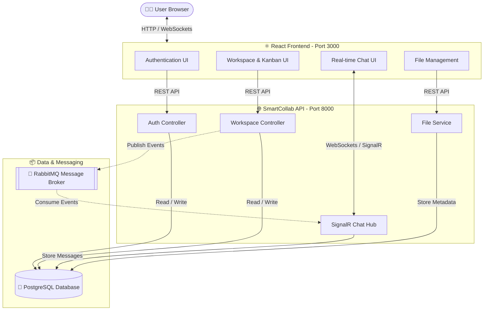

# 🚀 Smart Collaboration Workspace

<div align="center">


**A complete collaboration platform with Kanban boards, real-time chat, file sharing, and team management**

</div>

## 🏗️ Architecture Diagram



## ✨ Features

| Feature | Status | Description |
|---------|--------|-------------|
| 🔐 **Authentication** | ✅ | JWT-based secure login and registration system |
| 🏢 **Workspaces** | ✅ | Create, manage, and invite team members to shared workspaces |
| 📋 **Kanban Board** | ✅ | Interactive drag & drop tasks (Todo / In Progress / Done) |
| 💬 **Comments** | ✅ | Task-level discussions and updates |
| 📁 **File Sharing** | ✅ | Upload, download, and delete project files securely |
| 👥 **Team Management** | ✅ | Role-based access control (Admin / Member permissions) |
| ⚡ **Real-time Chat** | ✅ | Live messaging using SignalR and RabbitMQ event streaming |
| 📊 **Dashboard** | ✅ | Workspace analytics & task statistics |
| 📱 **Responsive UI** | ✅ | Modern, mobile-friendly design with Tailwind CSS |

---

## 🛠️ Installation & Setup Guide

Follow these steps to get the project running on your local machine.

### 1. Prerequisites
Ensure you have the following installed:
- **Node.js** (v18 or higher)
- **.NET 9 SDK**
- **PostgreSQL** (v16 or higher)
- **Docker Desktop** (optional, but recommended for RabbitMQ)
- **Git**

---

### 2. Clone the Repository
```bash
git clone https://github.com/LidyaGetachew/smart-collab-workspace.git
cd smart-collab-workspace
```

---

### 3. Database Setup (PostgreSQL)
1. Open your PostgreSQL tool (like pgAdmin or psql).
2. Create a new database named `smartcollab_db`.
3. The default connection string in `appsettings.json` is:
   `Host=localhost;Database=smartcollab_db;Username=postgres;Password=admin@123`
   > [!NOTE]
   > If your PostgreSQL password is different, update it in `backend/SmartCollabWorkspace/SmartCollab.API/appsettings.json`.

---

### 4. Running the Backend (API & Real-time Hub)
Open a terminal and run:
```bash
# Navigate to the API project
cd backend/SmartCollabWorkspace/SmartCollab.API

# Restore dependencies
dotnet restore

# Run the application
dotnet run --urls "http://localhost:8000"
```
The API will be available at `http://localhost:8000`. You can view the Swagger documentation at `http://localhost:8000/swagger`.

> [!TIP]
> The database tables will be created automatically on the first run thanks to `dbContext.Database.EnsureCreatedAsync()`.

---

### 5. Running the Frontend (React App)
Open a **new** terminal and run:
```bash
# Navigate to the frontend directory
cd frontend

# Install dependencies
npm install

# Start the development server
npm start
```
The frontend will open automatically at `http://localhost:3000`.

---

### 6. (Optional) Run RabbitMQ for Real-time Features
The chat features use RabbitMQ for event streaming. The easiest way to run it is via Docker:
```bash
docker run -d --name smartcollab_rabbitmq -p 5672:5672 -p 15672:15672 rabbitmq:4.0-management-alpine
```
*Login to management console at `http://localhost:15672` with `guest`/`guest`.*

---

## 🐳 Run Everything with Docker (One-Command)
If you have Docker Compose installed, you can start the entire stack (Postgres, RabbitMQ, Backend, and Frontend) with one command:

```bash
docker-compose up --build
```

**Access Points:**
- **Frontend:** http://localhost:3000
- **Backend API:** http://localhost:8000/swagger
- **RabbitMQ:** http://localhost:15672

---

## ❓ Troubleshooting

| Issue | Solution |
|-------|----------|
| **Database Connection Failed** | Ensure PostgreSQL is running and the credentials in `appsettings.json` match your local setup. |
| **Port 3000 or 8000 already in use** | Stop any other processes running on these ports or change the ports in the respective config files. |
| **Frontend can't connect to API** | Check `frontend/.env` to ensure `REACT_APP_API_URL` is set to `http://localhost:8000/api`. |
| **SignalR / Chat not working** | Ensure RabbitMQ is running (Step 6) as the backend depends on it for message broadcasting. |

---

## 📄 License
This project is licensed under the MIT License - see the [LICENSE](LICENSE) file for details.